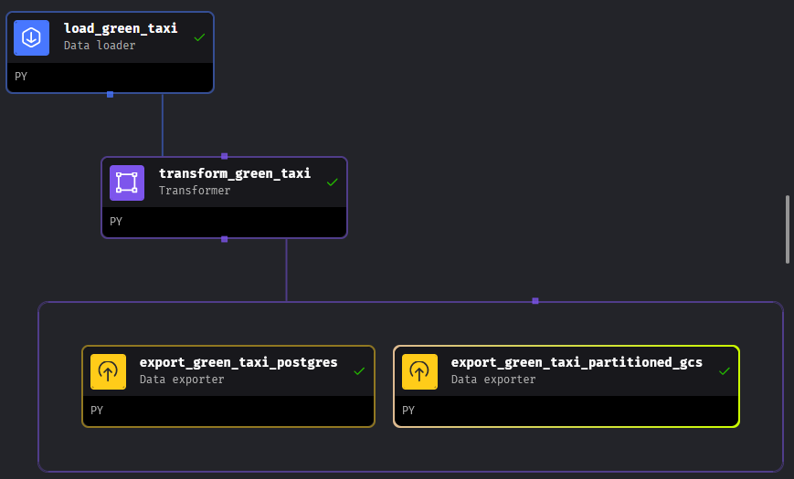

## What is orchestration?
- In data engineering, orchestration involves extracting, transforming, and loading data between sources.
- Orchestration is a process of dependency management, facilitated through automation. 
- The data orchestrator manages scheduling, triggering, monitoring, and resource allocation. 

## DE Zoomcamp's Orchestration
For this course it was used the following architecture:
 - **Extract**: NYC taxi dataset using API.
 - **Transform**: Clean, transform and partition the data (pandas and sql).
 - **Load**: API to Mage, Mage to Postgress, GCS, BigQuery.
 - Using Docker as container.

## What is Mage?
- An open-source pipeline tool for orchestrating, transforming, and integrating data.
- Building Blocks:
  * **Projects**: similar to a repository.
  * **Pipelines**: workflow that executes some data operation.
  * **Blocks**: file that can be executed independently or within a pipeline. 

## Homework
- Clone and follow steps in [repository: mage-zoomcamp](https://github.com/mage-ai/mage-zoomcamp).
- ETL pipeline that loads data from an API, perform some transformations, and writes the data to a Postgres database (and Google Cloud).
- Pipeline is named as **green_taxi_etl** and contains the following files:
  - *load_green_taxi*: load green taxi data related to last quarter 2020 from github repository.
  -  *transform_green_taxi*: remove rows, new column lpep_pickup_date, rename columns and test assertions.
  -  *export_green_taxi_postgres*: Postgres data exporter.
  -  *export_green_taxi_partitioned_gcs*: write data as Parquet files to a bucket in GCP, partioned by lpep_pickup_date and using the pyarrow library.
- Scheduled pipeline to run daily at 5AM UTC.

