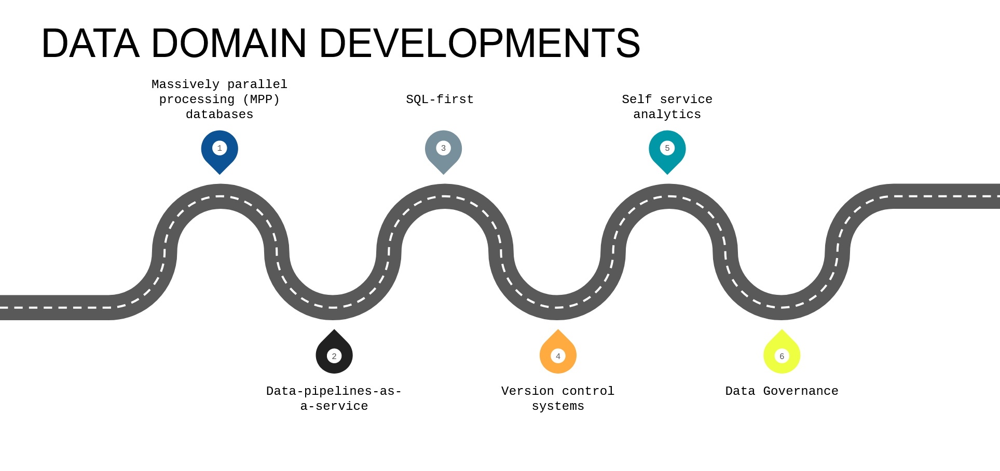
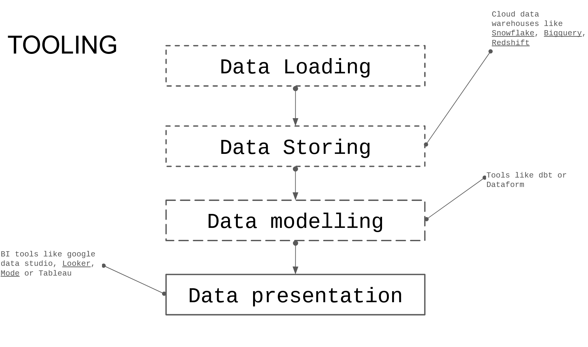
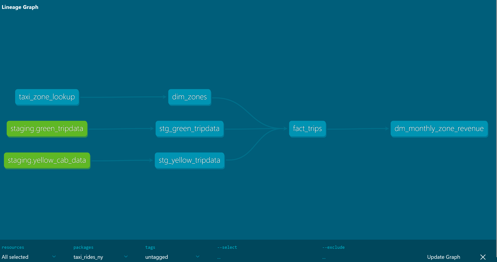
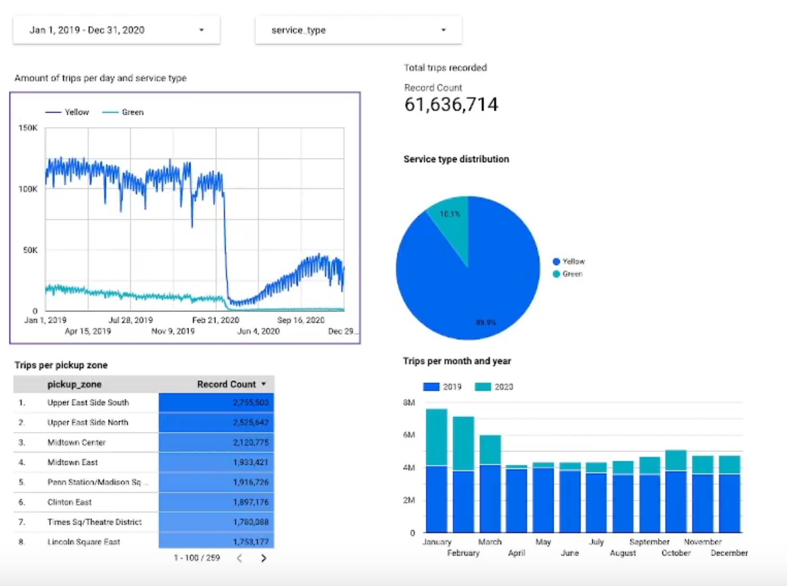

## Introduction
The data domain has developed over time, new tools have been introduced that have changed the dynamics of working with data.

## What is dbt?
dbt is a transformation workflow that allows anyone that knows SQL to deploy analytics code following software engineering best practices like modularity, portability, CI/CD, and documentation. 

### dbt Core
Open-source project that allows the data transformation.  
● Builds and runs a dbt project (.sql and .yml files)  
● Includes SQL compilation logic, macros and database adapters  
● Includes a CLI interface to run dbt commands locally  
● Opens source and free to use

### dbt Cloud
SaaS application to develop and manage dbt projects.  
● Web-based IDE and cloud CLI to develop, run and test a dbt project  
● Managed environments  
● Jobs orchestration  
● Logging and Alerting   
● Integrated documentation  
● Admin and metadata API  
● Semantic Layer

### How was dbt used?
BigQuery:  
● Development using cloud IDE  
● No local installation of dbt core

On deployment we receive our documentation and the lineage graph.

The final step is a dashboard in Locker Studio.
