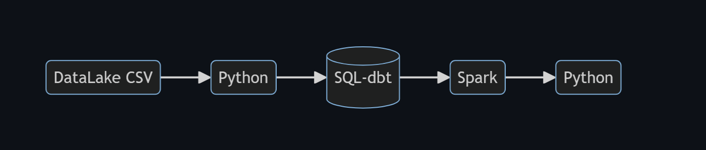
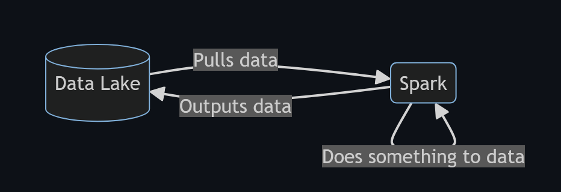
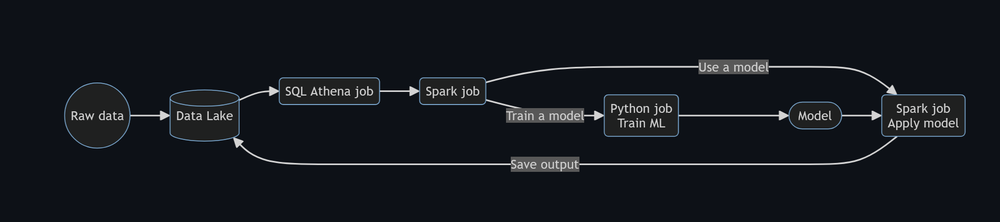
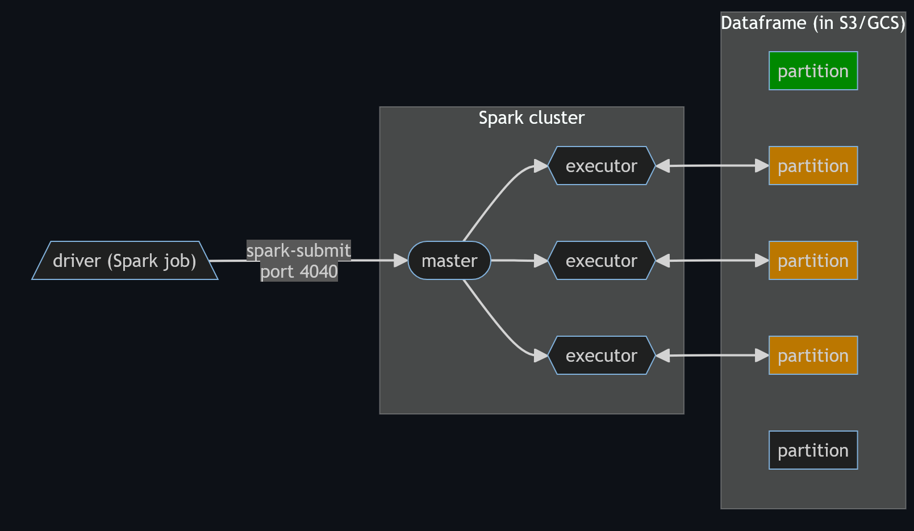
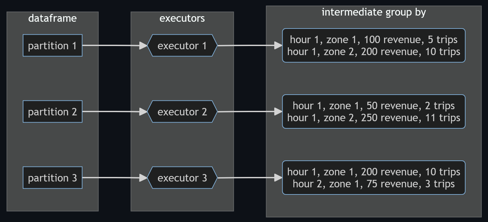
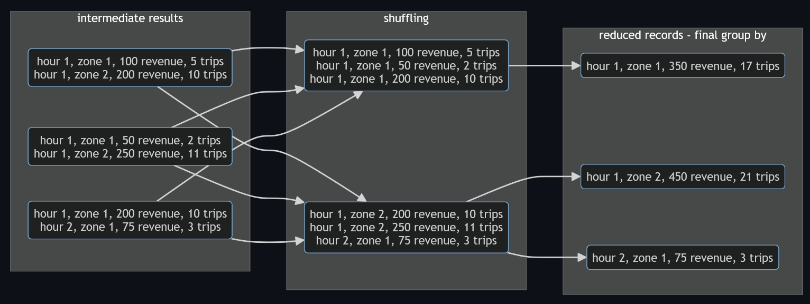

## Batch vs Streaming

There are 2 ways of processing data:

- **Batch** processing: processing chunks of data at regular intervals (weekly, daily, houly, etc.).
  -  Example: processing taxi trips each month.
- **Streaming**: processing data on the fly.
  - Example: processing a taxi trip as soon as is generated. 

## Introduction to Batch Processing

 Batch jobs are commonly orchestrated with tools such as Airflow. A common workflow for batch jobs may be the following:

**Advantages**:
- Easy to manage. There are multiple tools to manage them.
- Re-executable. Jobs can be easily retried if they fail.
- Scalable. Scripts can be executed in more capable machines; Spark can be run in bigger clusters, etc.

**Disadvantages**:
- Delay. Each task of the workflow in the previous section may take a few minutes; assuming the whole workflow takes 20 minutes, we would need to wait those 20 minutes until the data is ready for work.

## Introduction to Spark
Apache Spark is an open-source **multi-language** unified analytics **engine** for large-scale data processing.

- Spark can be ran in **clusters** with multiple **nodes**, each pulling and transforming data.
- Spark is **multi-language** because we can use Java and Scala natively, and there are wrappers for Python, R and other languages. The wrapper for Python is called PySpark.
- Spark can deal with both batches and streaming data. The technique for streaming data is seeing a stream of data as a sequence of small batches and then applying similar techniques on them to those used on regular badges.

## Why do we need Spark?
- Spark is used for transforming data in a Data Lake.
- There are tools such as Hive, Presto or Athena (a AWS managed Presto) that allow you to express jobs as SQL queries. However, there are times where you need to apply more complex manipulation which are very difficult or even impossible to express with SQL (such as ML models); in those instances, Spark is the tool to use.

A typical workflow may combine both tools. Below there's an example of a workflow involving Machine Learning. In this scenario, most of the preprocessing would be happening in Athena, so for everything that can be expressed with SQL, it's always a good idea to do so, but for everything else, there's Spark.

## Spark Clusters
Spark **cluster** is composed of multiple executors. Each executor can process data independently in order to parallelize and speed up work.

A file can only be read by a single executor. To parallelize the runs, files can split a file into multiple parts so that each executor can take care of a part and have all executors working simultaneously. These splits are called **partitions**.

## Actions vs Transformations
Some Spark methods are "lazy", meaning that they are not executed right away. However, running df.show() right after will execute right away and display the contents of the dataframe; the Spark UI will also show a new job.

These lazy commands are called transformations and the eager commands are called actions. Computations only happen when actions are triggered.

**List of transformations (lazy)**: Selecting columns, Filtering, Joins, Group by, Partitions,...

**List of actions (eager)**: Show, take, head, Write, read,...

[Quickstart for the PySpark DataFrame API](https://spark.apache.org/docs/latest/api/python/getting_started/quickstart_df.html)

## Internals of Spark

Spark internals are managed by:
- When we want to execute a Spark job, a **driver** (an Airflow DAG, a computer running a local script, etc.) will send the job to the master.
- Inside the cluster, we have a **master**, which behaves similarly to an entry point of a Kubernetes cluster, dividing the work among the cluster's **executors**.
- If any executor fails and becomes offline for any reason, the master will reassign the task to another executor.
- Each executor will fetch a **dataframe partition** stored in a Data Lake (usually S3, GCS or a similar cloud provider), do something with it and then store it somewhere, which could be the same Data Lake or somewhere else. If there are more partitions than executors, executors will keep fetching partitions until every single one has been processed.

This is in contrast to Hadoop, another data analytics engine, whose executors locally store the data they process. Partitions in Hadoop are duplicated across several executors for redundancy, in case an executor fails for whatever reason (Hadoop is meant for clusters made of commodity hardware computers). However, data locality has become less important as storage and data transfer costs have dramatically decreased and nowadays it's feasible to separate storage from computation, so Hadoop has fallen out of fashion.

## GroupBy in Spark
Since the data is split along partitions, it's likely that we will need to group data which is in separate partitions, but executors only deal with individual partitions. Spark solves this issue by separating the grouping in 2 stages:

1. In the first stage, each executor groups the results in the partition they're working on and outputs the results to a temporary partition. These temporary partitions are the **intermediate results**.

    
2. The second stage **shuffles** the data: Spark will put all records with the **same keys** (in this case, the **GROUP BY keys**) in the same partition. The algorithm to do this is called *external merge sort*. Once the shuffling has finished, we can once again apply the GROUP BY to these new partitions and **reduce** the records to the final output.
   - Note that the shuffled partitions may contain more than one key, but all records belonging to a key should end up in the same partition.
  

Notes:
- By default, Spark will repartition the dataframe to 200 partitions after shuffling data. For the kind of data we're dealing with in this example this could be counterproductive because of the small size of each partition/file, but for larger datasets this is fine.
- Shuffling is an expensive operation, so it's in our best interest to reduce the amount of data to shuffle when querying. 
- Keep in mind that repartitioning also involves shuffling data.

## Join in Spark
In Spark, joins work by distributing data across a cluster and then performing the join operation in parallel across different nodes. The process involves several steps and optimizations to efficiently manage and process the data. 

1. **Data Distribution**  
    Spark distributes data across a cluster of machines (nodes). When you perform a join, Spark needs to ensure that the data to be joined is located on the same node. This involves shuffling data across the nodes to align keys that need to be joined together.

2. **Shuffling**
    Shuffling is a process of redistributing data across partitions to ensure that records with the same key end up on the same partition. This is necessary for operations like joins, groupBy, and reduceByKey. During a join, each node sends data to other nodes based on the join key, which can be an expensive operation in terms of network and I/O.

Spark employs different strategies to execute joins based on the size and characteristics of the datasets being joined. The two primary strategies are:
- **Broadcast Join**  
    *When Used*: This strategy is used when one of the datasets is small enough to be broadcast to all nodes. Spark uses this strategy to avoid the shuffle step for the smaller dataset.  
    *How It Works*: The smaller dataset is copied to each node in the cluster, and each node joins the larger dataset with the broadcasted dataset locally.

- **Shuffle Join**
    *When Used*: This strategy is used when both datasets are large and cannot be broadcast.  
    *How It Works*: Spark redistributes the data across the cluster based on the join keys, so that records with the same key end up on the same partition. The join is then performed locally on each partition.

## Resilient Distributed Datasets (RDDs)
**Resilient Distributed Datasets (RDDs)** are the main abstraction provided by Spark and consist of collection of elements partitioned accross the nodes of the cluster.

Dataframes are actually built on top of RDDs and contain a schema as well, which plain RDDs do not.