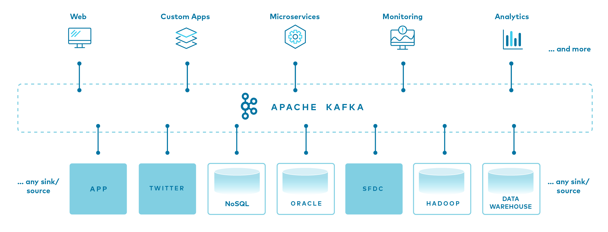

## Introduction to Apache Kafka
Apache Kafka is a *message broker* and *stream processor*. Kafka is used to handle *real-time data feeds*.

In a data project we can differentiate between consumers and producers:
- **Consumers** are those that consume the data: web pages, micro services, apps, etc.
- **Producers** are those who supply the data to consumers.

Connecting consumers to producers directly can lead to an amorphous and hard to maintain architecture. Kafka solves this issue by becoming an intermediary that all other components connect to. Kafka works by allowing producers to send *messages* which are then pushed in real time by Kafka to consumers.



### Kafka Advantages
- **Robustness**  
Replicates data across multiple brokers, making it resilient to node failures. If one broker goes down, others take over seamlessly.
- **Flexibility**  
Supports a variety of use cases, from real-time analytics to data integration and event-driven architectures. As well, Kafka integrates well with various consumers and can be used with different programming languages.
- **Scalability and High Throughput**  
It is designed for handling massive data volumes. It scales horizontally by adding more broker nodes, ensuring high throughput and accommodating growing workloads.

### Basic Kafka components
#### **Message**
The basic communication abstraction used by producers and consumers in order to share information in Kafka is called a message. Messages have 3 main components:
- **Key**: used to identify the message and for additional Kafka stuff such as partitions.
- **Value**: the actual information that producers push and consumers are interested in.
- **Timestamp**: used for logging.

#### **Topic**
A topic is an abstraction of a concept. Concepts can be anything that makes sense in the context of the project, such as "sales data", "new members", "clicks on banner", etc. A producer pushes a message to a topic, which is then consumed by a consumer subscribed to that topic.

#### **Broker**
A Kafka broker is a machine (physical or virtualized) on which Kafka is running. 

#### **Cluster**
A Kafka cluster is a collection of brokers (nodes) working together.

#### **Logs**
In Kafka, logs are data segments present on a storage disk. In other words, they're physical representations of data.

Logs store messages in an ordered fashion. Kafka assigns a sequence ID in order to each new message and then stores it in logs.

### Consumer Groups
A consumer group is composed of multiple consumers.

In regards of controlling read messages, Kafka treats all the consumers inside a consumer group as a single entity: when a consumer inside a group reads a message, that message will **NOT** be delivered to any other consumer in the group.

Consumer groups allow consumer apps to scale independently: a consumer app made of multiple consumer nodes will not have to deal with duplicated or redundant messages.

Consumer groups have IDs and all consumers within a group have IDs as well. The default value for consumer groups is 1. All consumers belong to a consumer group.

### Partitions

Topic logs in Kafka can be **partitioned**. A topic is essentially a wrapper around at least 1 partition.

Partitions are assigned to consumers inside consumer groups:
- A partition is assigned to **one consumer only**.
- One consumer may have multiple partitions assigned to it.
- If a consumer dies, the partition is reassigned to another consumer.
- Ideally there should be as many partitions as consumers in the consumer group.
    - If there are more partitions than consumers, some consumers will receive messages from multiple partitions.
    - If there are more consumers than partitions, the extra consumers will be idle with nothing to do.

Partitions in Kafka, along with consumer groups, are a scalability feature. Increasing the amount of partitions allows the consumer group to increase the amount of consumers in order to read messages at a faster rate. Partitions for one topic may be stored in separate Kafka brokers in our cluster as well.

Messages are assigned to partitions inside a topic by means of their key: message keys are hashed and the hashes are then divided by the amount of partitions for that topic; the remainder of the division is determined to assign it to its partition. In other words: hash modulo partition amount.

Using keys for assigning messages to partitions has the risk of making some partitions bigger than others. For example, if the topic client makes use of client IDs as message keys and one client is much more active than the others, then the partition assigned to that client will grow more than the others. In practice however this is not an issue and the advantages outweight the cons.

    Offset: each message in a partition has a unique and incremental id named offset. The incremental order is within each partition (not topic). Kafka keeps data for limited time (default 1 week). After deleting the offset, it will not get reset.


### __consumer_offsets
This allows to keep track of messages read by each consumer and topic. When a consumer reads messages and Kafka receives the information, Kafka posts a message to __consumer_offsets with the consumer ID, the topic, the partition and the message IDs (offset) that the consumer has read. 

If the consumer dies and spawns again, Kafka will know the last message delivered to it in order to resume sending new ones. If multiple consumers are present, Kafka knows which consumers have read which messages, so a message that has been read by consumer #1 but not by #2 can still be sent to #2.

### Replication

Partitions are replicated accross multiple brokers in the Kafka cluster as a fault tolerance precaution.

When a partition is replicated accross multiple brokers, one of the brokers becomes the leader for that specific partition. The leader handles the message and writes it to its partition log. The partition log is then replicated to other brokers, which contain replicas for that partition. Replica partitions should contain the same messages as leader partitions.

If a broker which contains a leader partition dies, another broker becomes the leader and picks up where the dead broker left off, thus guaranteeing that both producers and consumers can keep posting and reading messages.

We can define the replication factor of partitions at topic level. A replication factor of 1 (no replicas) is undesirable, because if the leader broker dies, then the partition becomes unavailable to the whole system, which could be catastrophic in certain applications.


## Kafka configurations
### Topic configurations
- **retention.ms**: due to storage space limitations, messages can't be kept indefinitely. This setting specifies the amount of time (in milliseconds) that a specific topic log will be available before being deleted.
- **cleanup.policy**: when the retention.ms time is up, we may choose to delete or compact a topic log.
    - Compaction does not happen instantly; it's a batch job that takes time.
- **partition**: number of partitions.
    - The higher the amount, the more resources Kafka requires to handle them. Remember that partitions will be replicated across brokers; if a broker dies we could easily overload the cluster.
- **replication**: replication factor; number of times a partition will be replicated.

### Consumer configurations
- **offset**: sequence of message IDs which have been read by the consumer.
- **consumer.group.id**: ID for the consumer group. All consumers belonging to the same group contain the same consumer.group.id.
- **auto_offset_reset**: when a consumer subscribes to a pre-existing topic for the first time, Kafka needs to figure out which messages to send to the consumer.
    - If set to **earliest**, all of the existing messages in the topic log will be sent to the consumer.
    - If set to **latest**, existing old messages will be ignored and only new messages will be sent to the consumer.

### Producer configurations
**acks**: behaviour policy for handling acknowledgement signals of data writes.
- **0**: "fire and forget". The producer will not wait for the leader or replica brokers to write messages to disk.
    - **Fastest** policy for the producer. Useful for time-sensitive applications which are not affected by missing a couple of messages every so often, such as log messages or monitoring messages.
- **1**: the producer waits for the leader broker to write the messaage to disk.
    - If the message is processed by the leader broker but the broker immediately dies and the message has not been replicated, the message is lost.
- **all**: the producer waits for the leader and all replica brokers to write the message to disk.
    - **Safest** but **slowest** policy. Useful for data-sensitive applications which cannot afford to lose messages, but speed will have to be taken into account.


## Kafka Streaming with Python
Demo of a Kafka system with a producer and a consumer and see how messages are created and consumed.

The demo has been implemented in 3 different setups: avro, json and pyspark (for streamming). Comparing json with avro, avro is more stable since we use schemas. Also, provides more abstraction to the serialization.
1. Follow the steps to create run Kafka Clusters on Docker
2. Create a virtual env and install packages
```bash
python -m venv .venv
source .venv/bin/activate
pip install -r requirements.txt
```
3. To produce messages: `python producer.py`
4. Then we can consume the data using: `python consumer.py`

```bash
# Run producer
python3 producer.py

# Run consumer with default settings
python3 consumer.py
# Run consumer for specific topic
python3 consumer.py --topic <topic-name>
```

### Docker File
Due to the complexity of managing a manual Kafka install, a docker-compose script was creared. The Docker images are provided by **Confluent**, a Kafka tool vendor. The script defines the following services:

- `zookeeper`: a centralized service for maintaining configuration info. Kafka uses it for maintaining metadata knowledge such as topic partitions, etc. Zookeeper is being phased out as a dependency, but for easier deployment it was during the course.
- `broker`: the main service that contains environment variables, which are provided for easier configuration.
- `schema-registry`: provides a serving layer for metadata.
- `control-center`: a web-based Kafka GUI. Kafka can be entirely used with command-line tools, but the GUI helps us visualize things.

For the stream example, it was also created the services: `jupyterlab`, `spark-master` and `spark-workers`.

The deployment is made with `docker-compose up`. It may take several minutes to deploy on the first run. Check the status of the deployment with `docker ps`. Once the deployment is complete, access the control center GUI by browsing to `localhost:9021`.

### Avro and Schema Registry

#### **Why are schemas needed?**  
Kafka messages can be anything, from plain text to binary objects. This makes Kafka very flexible but it can lead to situations where consumers can't understand messages from certain producers because of incompatibility (like a producer sending a PHP object to a Python consumer). In order to solve this, we can introduce a **schema** to the data so that producers can define the kind of data they're pushing and consumers can understand it.

#### **Introduction to Avro**  
Avro is a **data serialization system**. Serialization is transforming a data structure or object into a structure that can be stored or transmitted.

Unlike other serialization systems such as Protobuf or JSON, Avro stores the schema separated from the record. You need a separate Avro schema in order to read an Avro record. Records in Avro are stored using binary encoding and schemas are defined with JSON or IDL.

These features result in 3 main advantages:
- **Smaller record filesize** compared to other formats such as JSON.
- **Schema evolution**: you can evolve the schema overtime without breaking the consumers.
- Avro clients provide **automatic validation** against schemas. If you try to push an incompatible schema between versions, the Kafka Avro client will not allow you to do so.


#### Avro schema evolution
We can define 3 different kinds of evolutions for schemas:
- **Backward compatibility**: producers using older schemas generate messages that can be read by consumers using newer schemas.
- **Forward compatibility**: producers using newer schemas generate messages that can be read by consumers using older schemas. Consumers can read all records in the topic.
- **Mixed/hybrid versions**: ideal condition where schemas are both forward and backward compatible.


## KSQL
KSQL is a tool for specifying stream transformations in SQL such as joins. The output of these transformations is a new topic.

KSQL offers consumers such as Data Scientists a tool for analyzing Kafka streams: instead of having to rely on Data Engineers to deliver consumable data to a Data Warehouse, Scientists can now directly query Kafka to generate consumable data on the fly.

However, KSQL isn't mature yet and lacks many useful features for Data Engineers (are the topics formatted with Avro, or are they JSON or just strings? How do you maintain the code? Do we need to manage a resource-intensive KSQL cluster just for occasional queries? etc.)


## Kafka Connect
Kafka Connect is a tool which allows us to stream data between external applications and services to/from Kafka. It works by defining connectors which external services connect to. Services from which data is pulled from are called sources and services which we send data to are called sinks.


## Redpanda
Check README file on folder redpanda_example.