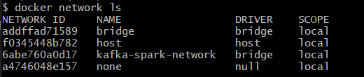
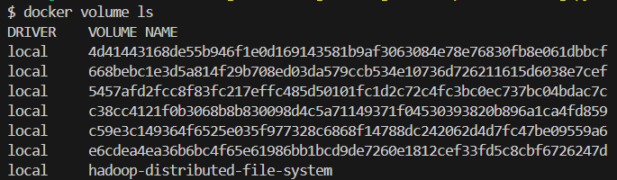
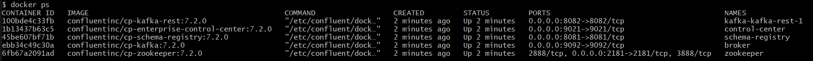
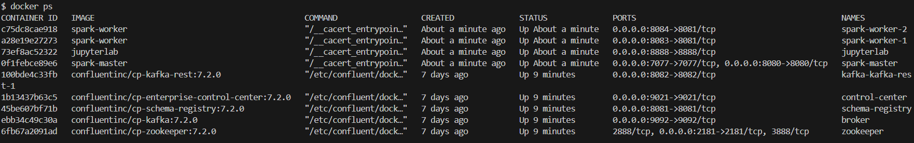

# Running Spark and Kafka Clusters on Docker

### 1. Build Required Images for running Spark

The details of how to spark-images are build in different layers can be created can be read through 
the blog post written by André Perez on [Medium blog -Towards Data Science](https://towardsdatascience.com/apache-spark-cluster-on-docker-ft-a-juyterlab-interface-418383c95445)

```bash
# Build Spark Image. Inside spark folder run:
./build.sh 
```

### 2. Create Docker Network & Volume

```bash
# Create Network
docker network  create kafka-spark-network

# Create Volume - allows to persist data that a container generated, even after deleting the container.
docker volume create --name=hadoop-distributed-file-system
```





### 3. Run Services on Docker
```bash
# Start Docker-Compose (within for kafka and spark folders)
docker compose up -d
```

In depth explanation of [Kafka Listeners](https://www.confluent.io/blog/kafka-listeners-explained/)

Explanation of [Kafka Listeners](https://www.confluent.io/blog/kafka-listeners-explained/)

### 4. Stop Services on Docker
```bash
# Stop Docker-Compose (within for kafka and spark folders)
docker compose down
```

### 5. Helpful Comands
```bash
# Delete all Containers
docker rm -f $(docker ps -a -q)

# Delete all volumes
docker volume rm $(docker volume ls -q)
```

### Confirm everything is ready

