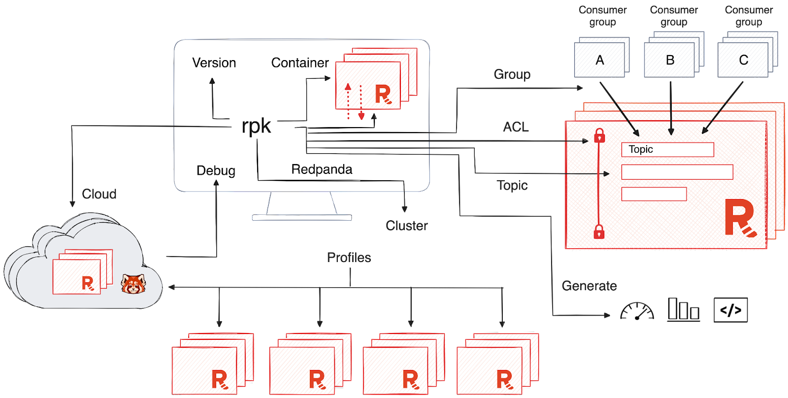

## Redpanda


[Redpanda](https://docs.redpanda.com/current/get-started/intro-to-events/) is an event streaming platform: it provides the infrastructure for streaming real-time data. Redpanda has available different courses on streaming data [here](https://university.redpanda.com/).


Redpanda is **less complex** and **less costly** than any other commercial mission-critical event streaming platform. It’s fast, it’s easy, and it keeps your data safe.

- It can scale up to use all available resources on a single machine and scale out to distribute performance across multiple nodes.
- Redpanda is packaged as a single binary: it doesn’t rely on any external systems.
- It’s compatible with the Kafka API, so it works with the full ecosystem of tools and integrations built on Kafka. - It is built on top of the Raft consensus algorithm and is designed as a **high-performance**, **low-latency** alternative to Kafka. It uses a log-centric architecture similar to Kafka but with different underlying principles.
- Raft facilitates communication between the nodes in a Redpanda cluster to make sure that they agree on changes and remain in sync, even if a minority of them are in a failure state. This allows Redpanda to tolerate partial environmental failures and deliver predictable performance, even at high loads.
- Redpanda provides data sovereignty.
- With the Bring Your Own Cloud (BYOC) offering, you deploy Redpanda in your own virtual private cloud, and all data is contained in your environment. Redpanda handles provisioning, monitoring, and upgrades, but you manage your streaming data without Redpanda’s control plane ever seeing it.



## PubSub example
### 1. Docker
    cd 06-streaming/python/redpanda_example/
    docker-compose up -d

### 2. Set RPK alias

Redpanda has a console command `rpk` which means Redpanda keeper, the CLI tool that ships with Redpanda and is already available in the Docker image.

Set the following rpk alias so it can be use from the terminal, without having to open a Docker interactive terminal.
    alias rpk="docker exec -ti redpanda-1 rpk"
    rpk version

### 3. Kafka Producer/Consumer Examples
    # Start consumer script, in 1st terminal tab
    python -m consumer
    # Start producer script, in 2nd terminal tab
    python -m producer

Run the python `-m producer command` again (and again) to observe that the `consumer` worker tab would automatically consume messages in real-time when new `events`.

### 4. Redpanda UI
You can also see the clusters, topics, etc from the Redpanda Console UI via your browser at http://localhost:8080.

Can also be used to perform administrative tasks such as creating, deleting, and configuring topics directly from the console.

### 5. rpk commands glossary

Visit [get-started-rpk](https://www.redpanda.com/blog/get-started-rpk-manage-streaming-data-clusters) blog post for more.

    # set alias for rpk
    alias rpk="docker exec -ti redpanda-1 rpk"

    # get info on cluster
    rpk cluster info

Before creating the topics, we should decide how we want to configure each topic.
- Partition count - controls the scalability of both the topic data and the total number of consumers of the stream.
- Replication factor - controls the fault tolerance of your data.
- dry - execute a dry run before actually creating the topics.
- topic-config - key-value pairs (formatted as key=value).

While we can alter the configuration after creating a topic, you should choose some reasonable values for the following properties up front. Each topic will be configured with the same settings if you use a single command.

    # create topic_name with m partitions and n replication factor
    rpk topic create [topic_name] --partitions m --replicas n

There are several ways to interact with a Redpanda topic.

    ```
    # get list of available topics, without extra details and with details
    rpk topic list
    rpk topic list --detailed

    # inspect topic config
    rpk topic describe [topic_name]

    # change the configuration values for a topic
    rpk topic alter-config [topic_name] --set [what you want to change]

    # add more partitions
    rpk topic add-partitions [topic_name] -n[extra number_partitions]

    # produce [topic_name]
    rpk topic produce [topic_name]

    # consume [topic_name]
    rpk topic consume [topic_name]
    --format -  specify the format of the output records.
    --num - By default, rpk will consume the topic continuously and won’t exit until you interrupt the process. However, you can also choose to consume a specific number of records. This is useful when sampling or inspecting a small amount of data from a Redpanda topic.
    --partitions - consume data from a particular partition. Without this flag, the rpk client will consume data from all of the partitions for the selected topic.

    # list the consumer groups in a Redpanda cluster
    rpk group list

    # get additional information about a consumer group, from above listed result
    rpk group describe my-group

    # delete [topic_name]
    rpk topic delete [topic_name]
    ```

While updating the partition count is easy using rpk, there are drawbacks to changing the partition count after topic creation. The biggest one is that if you’re using key-based routing to send messages with the same key to the same partition, the key->partition mapping may change when the topic is expanded which could then lead to out-of-order data.

An alternative is to create a brand new topic with the desired number of partitions and to transition to the new topic instead of repartitioning the original topic. This is an advanced topic that is beyond the scope of this lesson, but the takeaway is that although changing the partition count should not be a regular part of your workflow, it’s available when you need it.